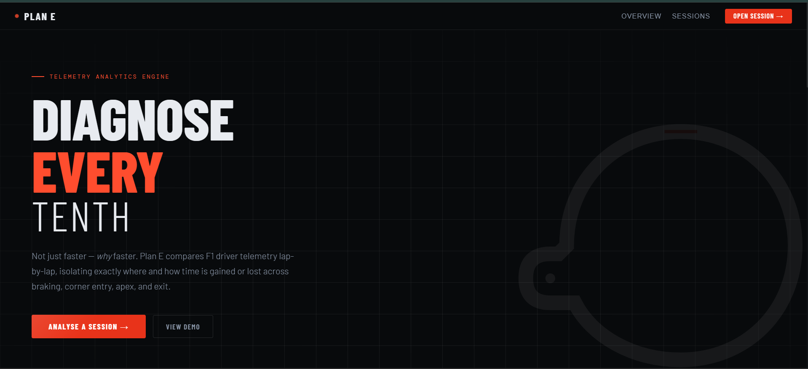
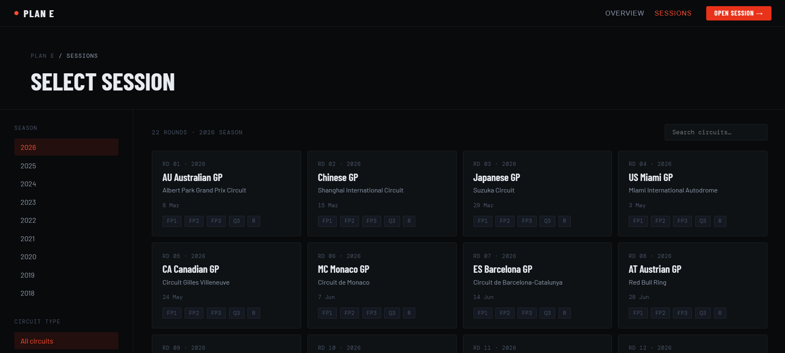
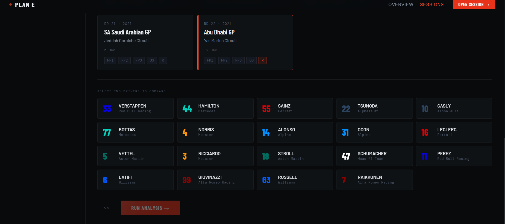
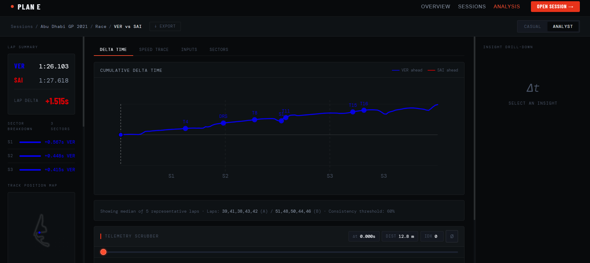
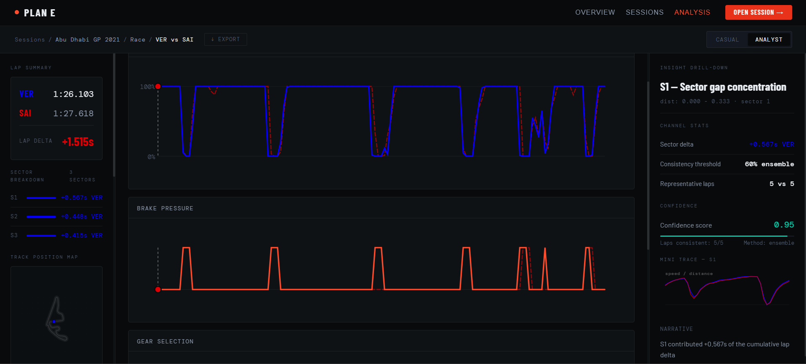

<p align="center">
  
</p>

<h1 align="center">🏎️ Plan E — F1 Telemetry Analysis Engine</h1>

<p align="center">
  <strong>Not just <em>faster</em> — <em>why</em> faster.</strong><br/>
  Plan E compares F1 driver telemetry lap-by-lap, isolating exactly where and how time is gained or lost across braking, corner entry, apex, and exit.
</p>

<p align="center">
  
  
  
  
  
  
</p>

---

## 📖 Project Overview

Formula 1 cars generate thousands of telemetry data points every second — speed, throttle, brake pressure, gear, GPS coordinates. But raw numbers don't tell you *why* Verstappen was 1.5 seconds faster than Sainz at Abu Dhabi.

**Plan E** takes that raw data and turns it into answers. It spatially aligns two drivers' laps onto the same physical track distance, calculates exactly where time was gained or lost, and generates human-readable insights like *"Driver A braked 12 meters later into Turn 4"* — all backed by statistical confidence scores.

The backend crunches the heavy math asynchronously so the UI never freezes. The frontend is built from scratch in Vanilla JS — no React, no Vue, no bundle — just raw DOM performance.

---

## ✨ Key Features

| Feature | What it does |
|---|---|
| **1,000-Point Spatial Grid** | Resamples both drivers' telemetry onto a standardized distance array using SciPy interpolation, enabling apples-to-apples comparison |
| **Async Job Architecture** | FastAPI returns a `job_id` instantly; Celery workers handle the heavy lifting in the background |
| **Telemetry Scrubber** | Drag a slider across the track distance and watch live Speed, Throttle, Brake, and Gear readouts update for both drivers simultaneously |
| **Heuristic Insight Detection** | Automatically identifies late braking, faster exit speeds, and throttle ramp differences with confidence scores |
| **Ensemble Lap Selection** | Filters out pit laps and anomalies, averaging 3–5 representative laps per driver for statistically sound comparisons |
| **Dual Audience Modes** | Toggle between "Casual" (plain English narratives) and "Analyst" (raw stats, confidence intervals, mini traces) |
| **Zero-Dependency Frontend** | Vanilla JS with direct SVG manipulation — no framework overhead, instant rendering |
| **Automated Cache Warming** | A preloader script detects completed F1 sessions and pre-downloads telemetry data before you even ask for it |

---

## 🏗️ Architecture Overview

Plan E follows a **decoupled async architecture**. Here's why that matters:

F1 telemetry analysis is computationally expensive — downloading race data, interpolating arrays, running heuristic detectors. If the server did all of this before responding to the browser, you'd be staring at a loading spinner for 30+ seconds with no feedback.

Instead, the system works like this:

```
┌─────────────┐       POST /api/analysis       ┌──────────────┐
│   Frontend   │ ──────────────────────────────► │   FastAPI     │
│  (Vanilla JS)│ ◄── { job_id, poll_url }────── │   Server      │
└──────┬───────┘                                └──────┬───────┘
       │                                               │
       │  GET /status (polling loop)                   │  dispatch task
       │                                               ▼
       │                                        ┌──────────────┐
       │                                        │    Celery     │
       │                                        │    Worker     │
       │                                        │              │
       │                                        │  FastF1 data │
       │                                        │  SciPy math  │
       │                                        │  Insights    │
       │                                        └──────┬───────┘
       │                                               │
       │         { status: COMPLETED, data: ... }      │
       │ ◄─────────────────────────────────────────────┘
       ▼
  Render Dashboard
```

1. **The frontend** POSTs a request and immediately gets back a `job_id`
2. **The Celery worker** picks up the job, downloads data, runs the math, and writes results to SQLite
3. **The frontend** polls `/api/analysis/{job_id}/status` in a loop, animating a progress bar
4. **When complete**, the full JSON payload is delivered and the dashboard renders instantly

This means the UI is **never blocked**, progress is **always visible**, and the system can **scale horizontally** by adding more workers.

---

## 📸 The UI

### Session Selector
Browse seasons from 2018–2026, pick a Grand Prix, and select a specific session (FP1, Qualifying, Race, etc.):

<p align="center">
  
</p>

### Driver Comparison Setup
Choose exactly two drivers to compare. The grid dynamically populates with drivers who actually participated in that session:

<p align="center">
  
</p>

### Analysis Dashboard — Delta Time
The cumulative delta chart shows exactly where time was gained or lost. Clickable insight dots mark key moments. The Telemetry Scrubber at the bottom lets you scan through the entire lap:

<p align="center">
  
</p>

### Analysis Dashboard — Input Traces & Insight Drill-Down
Overlay throttle, brake, and gear traces for both drivers. Click an insight dot and the right panel shows sector deltas, confidence scores, mini traces, and a narrative explanation:

<p align="center">
  
</p>

---

## 📂 Project Structure

```
F1 Telemetry Project/
│
├── start.bat                  # Launch both servers in one click
├── clear_cache.bat            # Flush corrupted telemetry caches
├── README.md
│
├── PlanE-backend/
│   ├── main.py                # FastAPI entry point, routes, job dispatch
│   ├── models.py              # SQLAlchemy ORM + Pydantic API schemas
│   ├── data_sources.py        # FastF1 & OpenF1 data acquisition + caching
│   ├── analysis_engine.py     # SciPy interpolation, delta calc, insight detection
│   ├── tasks.py               # Celery worker — async job execution
│   ├── preloader.py           # Automated cache warmer for completed sessions
│   ├── database.py            # SQLite engine & connection pooling
│   ├── config.py              # Environment variable management
│   ├── clear_cache.py         # Python cache flush utility
│   ├── requirements.txt       # Python dependencies
│   ├── .env.example           # Template for environment variables
│   └── pitwall.db             # SQLite database (auto-generated)
│
└── PlanE-frontend/
    ├── index.html             # Static SPA shell with SVG containers
    ├── dev_server.py          # Local Python HTTP server for development
    │
    ├── js/
    │   ├── state.js           # AppState singleton — centralized UI state
    │   ├── api.js             # fetch() wrapper with error handling
    │   └── router.js          # Minimal page transition controller
    │
    ├── pages/
    │   ├── selector.js        # Year → Race → Session → Driver wizard
    │   ├── loading.js         # Job polling loop + progress bar animation
    │   └── analysis.js        # Dashboard controller, scrubber, mode toggle
    │
    ├── components/
    │   ├── deltaChart.js      # Cumulative delta line + insight dots
    │   ├── trackMap.js        # 2D circuit layout with scrubber-linked dot
    │   ├── speedChart.js      # Speed trace overlay (Driver A vs B)
    │   ├── throttleChart.js   # Throttle trace overlay
    │   ├── brakeChart.js      # Brake pressure trace overlay
    │   ├── gearChart.js       # Gear selection trace overlay
    │   ├── waterfallChart.js  # Sector-by-sector time delta waterfall
    │   ├── lapSummary.js      # Lap time + sector breakdown panel
    │   └── insightList.js     # Insight drill-down with stats & narratives
    │
    └── css/
        ├── layout.css         # Grid system, page structure, responsiveness
        ├── components.css     # Buttons, toggles, loading bars, badges
        └── analysis.css       # Dashboard charts, tooltips, scrubber styling
```

---

## 🛠️ Tech Stack

| Technology | Role |
|---|---|
| **FastAPI** | High-performance async Python web framework powering the REST API |
| **Celery** | Distributed task queue for background telemetry processing |
| **Redis** | Message broker connecting FastAPI to Celery workers |
| **SQLite** | Lightweight local database for job tracking and result caching |
| **SQLAlchemy** | ORM layer for database models and queries |
| **Pydantic** | Strict request/response validation and data serialization |
| **SciPy** | 1-D interpolation (`interp1d`) for spatial telemetry alignment |
| **FastF1** | Official F1 telemetry, lap timing, and weather data library |
| **OpenF1** | Fallback API for driver metadata (names, teams, car numbers) |
| **Vanilla JS** | Zero-dependency frontend with direct DOM/SVG manipulation |

---

## 🚀 Getting Started

### Prerequisites
- Python 3.11+
- Redis server (for Celery task queue)
- Git

### Setup

```bash
# 1. Clone the repository
git clone https://github.com/Heytish-V/f1-telemetry-analysis.git
cd f1-telemetry-analysis

# 2. Set up the backend
cd PlanE-backend
python -m venv .venv
.venv\Scripts\activate        # Windows
pip install -r requirements.txt

# 3. Configure environment
cp .env.example .env
# Edit .env with your Redis URL and cache paths

# 4. Launch everything (Windows)
cd ..
start.bat
```

`start.bat` opens two terminal windows automatically:
- **Window 1:** Activates the venv and starts the FastAPI server on port `8000` via `uvicorn`
- **Window 2:** Starts the frontend dev server via `dev_server.py`

### Useful Scripts

| Script | What it does |
|---|---|
| `start.bat` | Launches both backend and frontend servers simultaneously |
| `clear_cache.bat` | Flushes the FastF1 telemetry cache if data gets corrupted |

---

## 🏎️ How It Works — A Full Walkthrough

Here's what happens when you compare two drivers, end to end:

### Step 1: Select a Session
You land on the **Selector** page. `pages/selector.js` fetches available seasons from the `/api/seasons` endpoint. Pick a year, and it fetches races. Click a session pill (FP1, Q3, Race) to lock in your session.

### Step 2: Pick Two Drivers
The driver grid populates dynamically — only drivers who actually participated in that specific session appear. Select exactly two. The `AppState` singleton in `js/state.js` tracks your selections, ensuring a clean data flow.

### Step 3: Run Analysis
Click **"Run Analysis →"**. The frontend POSTs to `/api/analysis` with your selections. The backend in `main.py`:
1. Generates a unique cache key
2. Creates an `AnalysisJobORM` record with status `PENDING`
3. Dispatches a Celery task via `run_analysis_task.delay()`
4. Returns a `job_id` and polling URL **immediately**

### Step 4: Watch Progress
`pages/loading.js` enters a `setTimeout` polling loop, hitting `/api/analysis/{job_id}/status` every few seconds. Meanwhile, `tasks.py` (the Celery worker):
- Fetches telemetry from FastF1 via `data_sources.py`
- Feeds it into `analysis_engine.py`
- Resamples both drivers onto a **1,000-point spatial distance grid** using `scipy.interpolate.interp1d`
- Calculates cumulative delta time: `Δt = Σ(ds / v)`
- Runs heuristic detectors for late braking, exit speed, throttle ramp
- Serializes the result as JSON and saves it to SQLite

The progress bar animates in real time as the worker reports back.

### Step 5: Explore the Dashboard
When status hits `COMPLETED`, `pages/analysis.js` takes over. It:
- Saves the massive JSON payload into `AppState`
- Distributes array data to `deltaChart.js`, `trackMap.js`, `speedChart.js`, etc.
- Binds the **Telemetry Scrubber** — dragging it reads index 0–999 and simultaneously updates live readouts for both drivers

Toggle between **Casual** mode (plain English) and **Analyst** mode (raw statistics, confidence scores, mini trace charts) using the top-right switch.

---

## 👨‍💻 Development & Contribution

### Architectural Patterns to Follow

- **Keep it async.** Never make the FastAPI server block on data processing. Always dispatch to Celery and let the frontend poll.
- **Respect the 1,000-point grid.** If you add new telemetry channels (steering angle, tire temps), interpolate them onto the spatial array in `analysis_engine.py` using `interp1d`. Time-based arrays will break chart alignment.
- **State is sacred.** On the frontend, never read data from the DOM. Always go through `AppState.getState()` in `js/state.js`. This is what keeps the SPA predictable.
- **Components are pure renderers.** Files in `components/` should consume arrays and render SVGs — nothing else. Orchestration logic belongs in `pages/`.

### Where to Add New Features

| Want to... | Look at... |
|---|---|
| Add a new telemetry channel | `analysis_engine.py` → interpolation section |
| Add a new chart type | `components/` → create a new JS module |
| Add a new API endpoint | `main.py` → add a FastAPI route |
| Add a new insight detector | `analysis_engine.py` → heuristic section |
| Change the UI layout | `css/layout.css` and `index.html` |

---

## 🔮 Future Improvements

- **Live Timing Integration** — Hook into live race webhooks for real-time analysis during sessions
- **Docker Compose** — Spin up Redis, backend, and frontend in one `docker-compose up` command
- **Additional Channels** — Steering angle, tire wear models, and DRS activation if they become available via FastF1
- **Multi-Driver Comparison** — Expand beyond two-driver comparisons to full grid analysis
- **Export & Sharing** — Generate shareable PDF reports or embed links for analysis results

---

<p align="center">
  <em>Built for the love of data and racing.</em>
</p>
